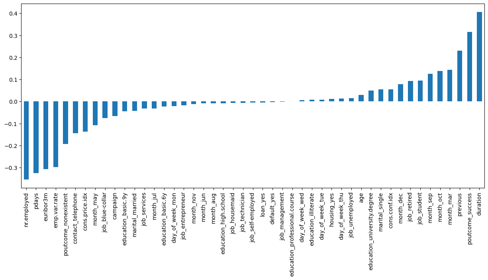
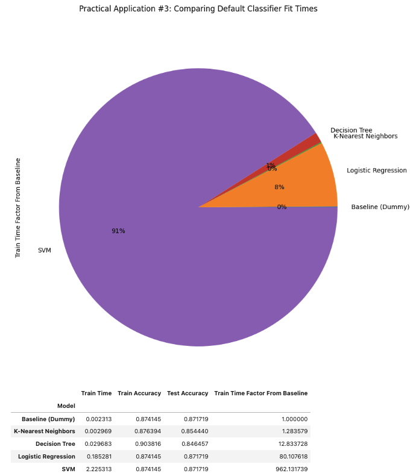
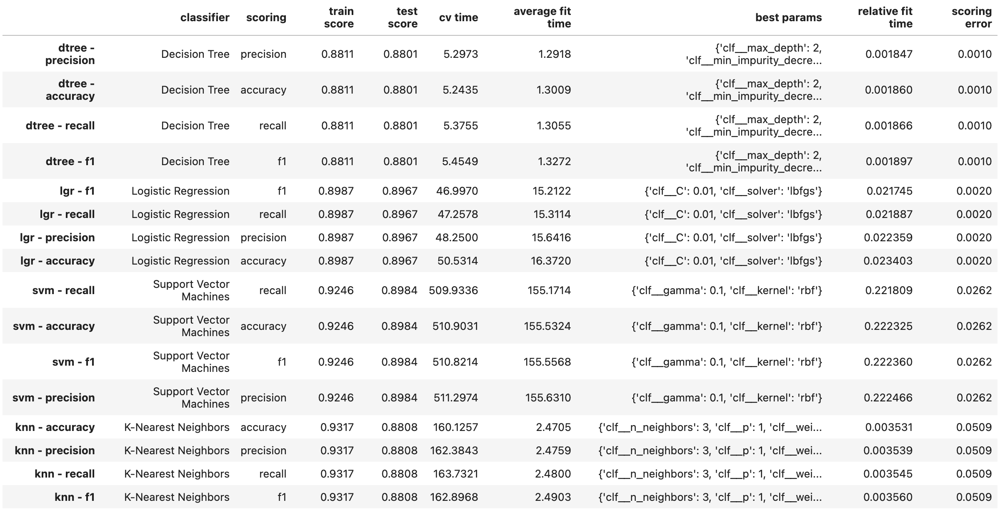
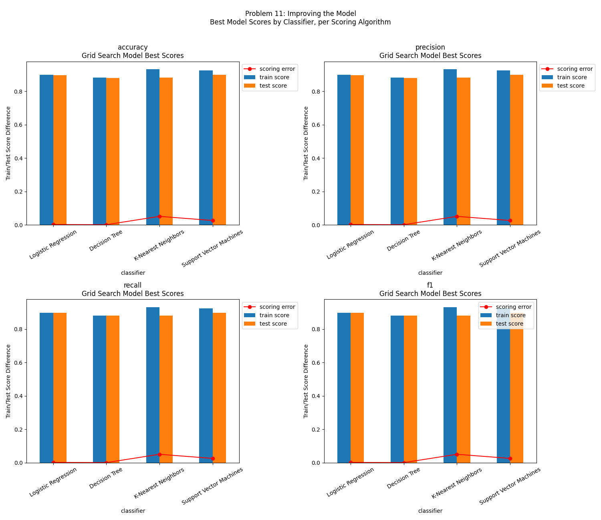
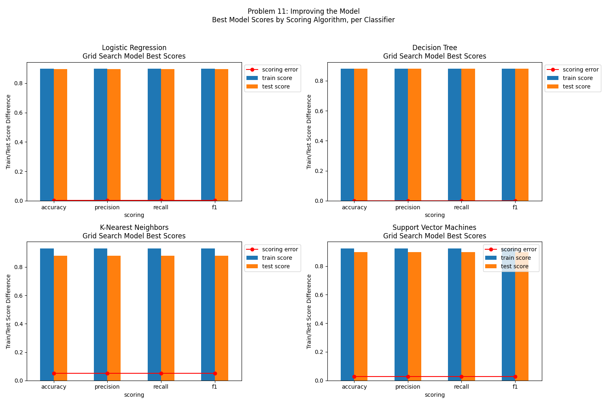

# Comparing Classifiers

Inspired by the ***CRISP-DM*** data analysis framework, the following summary compares performance of different classifiers to help our client -- a Portugese bank -- to determine if a prospective customer (a "prospect") being called is likely to subscribe to one of their products, term deposits.

The summaries and hypotheses indicated below are supported by the raw technical and statistical evaluations found within this [Jupyter Notebook](https://github.com/ard1038/data-analysis/blob/master/comparing-classifiers-pa3/pa3-comparing-classifiers.ipynb).

## 1. Business Understanding

1. Direct marketing campaigns can be enhanced through the use of business intelligence (BI) and data mining (DM) techniques, to improve their conversion rates or campaign efficacy.
2. Understanding the main characteristics that affect a prospect to convert to a customer (e.g. subscribe, purchase) may increase conversion rates (e.g. improve targeting criteria for prospective customers), and/or optimize operating overhead (e.g. human effort, phone calls, time).

### 1.1 Business Goals and KPIs

* Using an optimized classification model, empower marketing managers to prioritize prospects more likely to subscribe to term deposits, thereby improving subscriber conversion rates.
* As a result, improve return on investment (ROI) by reducing the number of human resource hours needed to acheive the same revenue levels. 
* While focusing on prospects most likely to subscribe, the client will not want to ignore reaching out to prospects that could be a "maybe" and need more information to decide, or those the algorithm classified as unlikely to subscribe, but may be interested (false negatives, or opportunities).
* Increase efficiency of directed campaigns for long-term deposit subscriptions by improving contact targeting to those predicted as more likely to subscribe.

### 1.2 Data Mining Goals and KPIs

The [initial study](CRISP-DM-BANK.pdf) cites using Naive Bayes, Decision Tree, and Support Vector Machine (Gaussian kernel) classifiers to model the dataset to predict if a prospect may subscribe to a term deposit account. This evaluation seeks to expand the types of classifiers, compare which may perform best, determining if a differnt classifier or optimized model would be more robust and performant.

The goals are as follows:
1. Build a predictive model that can label a data item into one of two predefined classes (e.g. “yes”, “no”)
2. Test different classification models and hyperparameters to determine classification and prediction trade-offs that best suit the most relevant scoring algorithm, to determine the most optimal for the dataset.

## 2. Understanding and Preparing the Data

The dataset comes from the UCI Machine Learning repository [link](https://archive.ics.uci.edu/ml/datasets/bank+marketing).  The data is from a Portugese banking institution and is a collection of the results of multiple marketing campaigns.  We will make use of the article accompanying the dataset [here](CRISP-DM-BANK.pdf) for more information on the data and features.

As a preliminary exploration of the dataset (EDA), various statistical approaches and visualizations are reviewed: 
* Review data integrity to inform decisions to either transform, impute, or drop null data values from the dataset. (e.g. measures of central tendency, missing values, duplicated records)
* Understand each feature's value sets and data type to determine if any type changes or feature engineering will be beneficial. (univariate analysis)
* Generate a correlation matrix to understand if any features demonstrate multicollinearity and should be omitted from the prepared dataset to model against. (bivariate analysis)
* Generate plots as relevant to understand how different feature values may impact sale pricing.

From this analysis, the following observations, inferences, conclusions and next actions to prepare the dataset for modeling are detailed.

* Initially, let's drop all missing values to evaluate model scoring. Imputation can be revisited to improve model later.
* Duplicate values exist, they should be dropped
* Categorical features:
    * All categorical features seem to have reasonable number of unique values to be binarized; check correlations
    * Once binarized, the following features were highly correlated and should be removed:
        * `poutcome`: values highly correlated to `pdays` and `previous`, remove the feature (`poutcome`)
        * `emp.var.rate`, `nr.employed` and `euribor3m`: highly correlated to each other, drop 2 of them (`nr.employed`, `euribor3m`)
* Numerical features:
    * Most features do not have normal distributions
    * Values must be scaled
* Target feature:
    * When a "yes" was recorded as the target outcome, the following reflects which binarized features positively and negatively correlate to the outcome, and their correlation magnitudes. 

## 4. Modeling

The objective of each classification modeling technique is to discern if a prospect is likely to subscribe to the term deposit product based on their feature traits.

As an initial modeling attempt, following five (5) classification techniques will be used to model the relationships between different features (as indicated within our dataset), and the target outcome.  The `DummyClassifier()` technique will be used to establish a naive baseline from which the other models should demonstrate performance improvements.

1. K-Nearest Neighbors
2. Logistic Regression
3. Decision Trees
4. Support Vector Machines
5. Dummy Classifier (baseline)

The following approach and parameters are common to all model candidates:
*  Cleaned and prepared dataset size and number of features:
    * Original dataset size: 41,188 records
    * Cleaned dataset size: 30,478 records
    * Percentage of Original Data Preserved: 74% 
* Train/Test ratio: *70/30*

### 4.1 Modeling Classifiers With Default Settings

Initially, the above-indicated classifiers were fit with their own default settings to establish a baseline model for each classifier, as well as for any classifier. Each classifier was scored against the training and test data sets, where it was observed that regardless of which classifier was modeled, they all had reasonably similar test dataset scores. 

While the scores were similar (with default settings), the fit times were dramatically different by classifier. The pie chart and table below illustrate how the `DummyClassifier()` acheived equivilent scoring results (~87%) as the other classifiers, and took a fraction of the time.  `SVM()` on the other hand took over *962 times longer* than the `DummyClassifier()`, but failed to score relatively higher. 

Download the CSV output from [default classifier performance comparison](results/comparing-classifiers-default-performance.csv).

#### 4.2 Improving the Models

With basic classification models established, how can the classification models be improved? Different hyperparameters and performance metrics will be evaluated through `GridSearchCV()` with `k-fold=3` cross-validation to determine which parameters and metrics result in the best models. 

##### 4.2.1 Feature Engineering

Each model will train and validate with the same transformed datasets, with:
* Binarization of selected categorical features: `['job', 'marital', 'education', 'default', 'housing', 'loan', 'contact', 'month', 'day_of_week']`
* Scaling of selected numerical features: `['age', 'duration', 'campaign', 'pdays', 'previous', 'emp.var.rate', 'cons.price.idx', 'cons.conf.idx']`

##### 4.2.2 Hyperparameter Tuning

Each classifier technique provides it's own set of hyperparameters that can be tuned to improve the model's performance. The following hyperparameters will be tuned for their model, selecting the best parameters through `GridSearchCV()` cross-validation:

1. K-Nearest Neighbors
    * ***n_neighbors:*** `list(range(3, 23, 2))` (intentionally skips value: `1`)
    * ***weights:*** `['uniform', 'distance']`
    * ***p:*** `[1, 2, 3, 4]`   
2. Logistic Regression
    * ***C:*** `[0.01, 0.1, 1, 10, 100]`
    * ***solver:*** `['lbfgs', 'liblinear', 'newton-cg', 'newton-cholesky', 'sag', 'saga']`
3. Decision Trees
    * ***impurity_decrease:*** `[0.01, 0.02, 0.03, 0.05]`
    * ***max_depth:*** `[2, 5, 10]` (intentionally excludes value: `None`)
    * ***min_samples_split:*** `[0.1, 0.2, 0.05]`
4. Support Vector Machines
    * ***kernel:*** `['rbf', 'poly', 'linear', 'sigmoid']`
    * ***gamma:*** `[0.1, 1.0, 10.0]` 

##### 4.2.3 Performance Metric Review

The following performance (scoring) metrics will be tested for impact to model robustness:
1. accuracy
2. precision
3. recall
4. f1

#### 4.3 Evaluating Improved Models

While each of the above classification techniques has a different mathematical approach to determine it's best modeling parameters, they are all similarly measured and optimized through cross-validation of specific performance metric(s).

The table below indicates the modeling technique, performance metric, the optimized hyperparameter values that resulted in the best score (as a decimal), as well as information on fit time.  

When scoring on the test set is reasonably equivilent between different classifiers, the fit time can be the next decision criteria in classifier selection as it indicates the cost to run the model in a production environment (shorter fit times will be more efficient to re-train and deploy).

In testing the different performance metrics, there seemed to be no difference in scoring, but there were differences in fit times, as illustrated in the charts below.  

While all four classifier models improved slightly through hyperparameter tuning, the best overall classifier model for this dataset is using the `Support Vector Machines` model with hyperparameters of `gamma =  0.1`, and `kernel = 'rbf'` based on scoring against the unseen validation dataset. Almost equal but next best performance was from `Logistic Regression` classifier, whose average fit time was about one tenth (10%) of the SVM fit time.  When considering performance and fit time together, Logistic Regression is likely the more supportable model for a production deployment.

**Summary:**
* *Best overall classifier:* `Logisitic Regression`
* *Optimized Hyperparameters:*
    * *C:* `0.01`
    * *solver:* `'lbfgs'`

Download the CSV output from [improving modeling performance](results/improving-classifier-performance.csv).

## 5. Deployment

With each classifier model candidate optimized for it's hyperparameters based on the evaluation metrics, the one that performs best overall is selected to put into practice. While a deployable model was not created as part of this assignment, it could be done so some effort by saving the model via a utility like `pickle`, and then reading it in runtime when features are provided for a prospect, to classify them as likely or unlikely to subscribe to a term deposit.

## 6. Next Steps

1. With the initial model trained and capable of classifying if a prospect may subscribe to a term deposit, deploying the application and creating a maintenance and monitoring plan to allow the client to self-serve when a new prospecting list is sourced will be a natural next phase.
2. With more compute power, a deeper dive into improve each classifier model further may result in a different classifier performing best (e.g. increasing number of `k-folds`)
3. Additional performance metrics may be reviewed to further improve the model (e.g. `roc_aoc` for probablistic classifier models and confusion matrices).