# Exploratory Data Analysis (EDA): Will the Customer Accept the Coupon?

Inspired by the ***CRISP-DM*** data analysis framework, the following summary uses statistical analysis and visualizations to explore the viability of a new business opportunity, to suggest if further investment is worthwhile to further mature the opportunity.

The summaries and hypotheses indicated below are supported by the raw technical and statistical evaluations found within this [Jupyter Notebook](https://github.com/ard1038/data-analysis/blob/master/couponing-proposal-pa1/eda-digital-couponing.ipynb).

## 1. Business Understanding

Imagine driving through a town, and a coupon is delivered to your cell phone for a restaraunt near where you are driving. To better understand the performance and viability of digital coupon acceptance:
* Would you accept that coupon and take a short detour to the restaraunt?
* Would you accept the coupon but use it on a subsequent trip? 
* Would you ignore the coupon entirely? 
* What if the coupon was for a bar instead of a restaraunt?
* What about a coffee house? 
* Would you accept a bar coupon with a minor passenger in the car? 
* What about if it was just you and your partner in the car? 
* Would weather impact the rate of acceptance? 
* What about the time of day?

These initial questions (and others) will be explored to glean insights to profile a customer's propensity to accept a targeted coupon.

### 1.1 Background

ADCo, a company specializing in distributing physical coupons for its local, small/medium business advertisers ("SMB"), is evaluating a new *digital* coupon revenue model. They seek to create a digital coupon serving platform which targets and delivers a relevant digital coupon to a vehicle's customer ("customer") through a mobile application, as they are driving proximate distances to one of their SMB's business locations. Before significantly investing to build this new revenue model (mobile application, middleware, infrastructure, product marketing, etc), ADCo has smartly solicited a survey to gather key information that can be investigated statistically to offer insights into it's viability.

### 1.2 Business Goals and KPIs

From an exploration of the survey data, the Company is keen to understand:
* What are the factors that determine whether a customer accepts the coupon once it is delivered to them?
* How would you determine whether a customer is likely to accept a coupon?
* Are there any types of customers we could target to encourage a higher coupon acceptance rate?

*Presumption:* The Company's technology is capable of sending/notifying a customer's cellphone a coupon offer through their mobile appto a business in proximity to their current location.

### 1.3 Data Mining Goals and KPIs

This data is sourced from the UCI Machine Learning repository and was collected from a survey conducted through Amazon Mechanical Turk. The survey describes different driving scenarios including the destination, current time, weather, passenger, etc., and then ask the person whether he will accept the coupon if he is the customer. Answers that the user will drive there ‘right away’ or ‘later before the coupon expires’ are labeled as ‘Y = 1’ and answers ‘no, I do not want the coupon’ are labeled as ‘Y = 0’. There are five different types of coupons -- less expensive restaurants (under $20), coffee houses, carry out & take away, bar, and more expensive restaurants ($20 - $50).

Once cleansed, the data contained 12.6K records, a more than sufficient volume to analyze and draw conclusions, with the following KPIs:
* Create cohorts of customers based on available information to understand their acceptance rates
* Highlight differences between customers who did and did not accept coupons.

## 2. Data Understanding and Preparation

### 2.1 Data Cleansing

* **Duplicate observations:** The dataset contained less than 1% duplicated data rows, which were removed from the dataset to prevent skewing the analysis.
* **Missing data** Upon analyzing the dataset for completeness *(ref: Image: "Heatmap Visualizing the Spread of Missing Data")*, while it would be nice to remove all missing data to retain a fully populated set, the decisions from our investigation in 2.4 within the notebook are as follows:
    * `car` feature review:
        * **Analysis:** It contains ***more than 99% missing values***, and cannot consider it in modeling even if it would be valuable information.
        * **Decision:** Rather than drop it, ***keep it for now*** in case there's further granular (anecdotal) insights as we dive deeper
    * `CoffeeHouse` feature review:
        * **Analysis:** It contains ***less than 2% missing values***, a reasonably minor amount to either drop or interpolate (replacing NaNs with "lowest" categorical value, e.g. "never"). Inferring "never" as an replacement for missing values would be equivicol, as it presumes a preference. 
        * **Decision:** As this visiting preference will be used later in this evaluation, ***missing data will be dropped***, as to not incorrectly skew any analysis that includes this preference.
    * `Restaurant20To50` feature review:
        * **Analysis:** It contains ***less than 1.5% missing values***, a reasonably minor amount to either drop or interpolate (replacing NaNs with "lowest" categorical value, e.g. "never"). Inferring "never" as an replacement for missing values would be equivicol, as it presumes a preference. 
        * **Decision:** As this visiting preference will be used later in this evaluation, ***missing data will be dropped***, as to not incorrectly skew any analysis that includes this preference.
    * `CarryAway` feature review:
        * **Analysis:** It contains ***less than 1.2% missing values***, a reasonably minor amount to either drop or interpolate (replacing NaNs with "lowest" categorical value, e.g. "never"). Inferring "never" as an replacement for missing values would be equivicol, as it presumes a preference. 
        * **Decision:** As this visiting preference will be used later in this evaluation, ***missing data will be dropped***, as to not incorrectly skew any analysis that includes this preference.
    * `RestaurantLessThan20` feature review:
        * **Analysis:** It contains ***less than 1.1% missing values***, a reasonably minor amount to either drop or interpolate (replacing NaNs with "lowest" categorical value, e.g. "never"). Inferring "never" as an replacement for missing values would be equivicol, as it presumes a preference. 
        * **Decision:** As this visiting preference will be used later in this evaluation, ***missing data will be dropped***, as to not incorrectly skew any analysis that includes this preference.
    * `Bar` feature review:
        * **Analysis:** It contains ***less than 1% missing values***, a reasonably minor amount to either drop or interpolate (replacing NaNs with "lowest" categorical value, e.g. "never"). Inferring "never" as an replacement for missing values would be equivicol, as it presumes a preference. 
        * **Decision:** As this visiting preference will be used later in this evaluation, ***missing data will be dropped***, as to not incorrectly skew any analysis that includes this preference.
    * **Ignored or redundant data:**
        * We can only consider one of the two `direction*` features as they are inverses of each other
        * We will treat `car` feature as anecdotal information, due to significant missing data

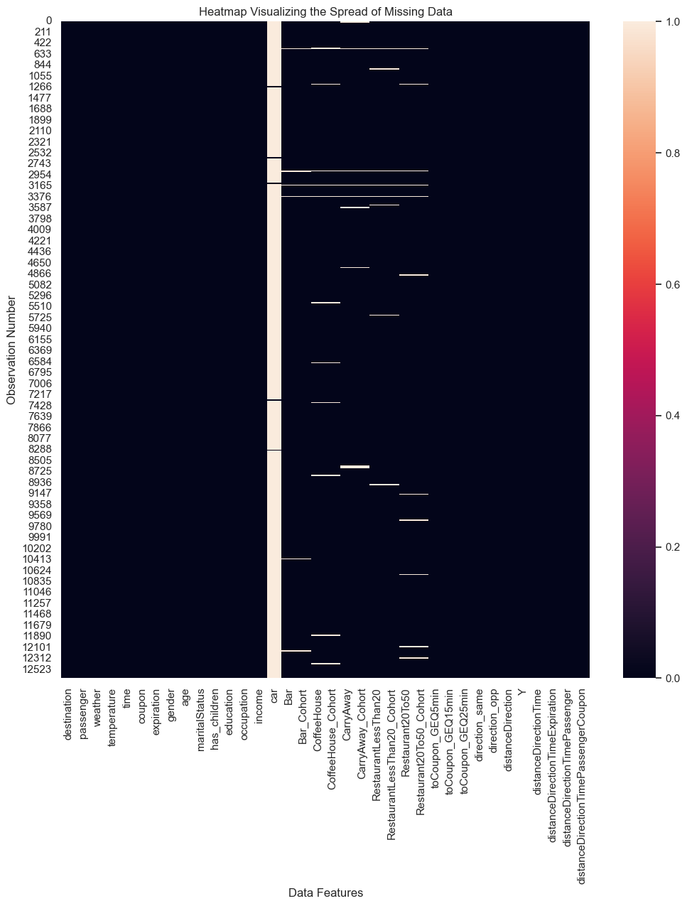

### 2.2 Bivariate Analysis

Each data feature was plotted and evaluated with context of coupon acceptance ("Y"), to glean insights into any correlations between the feature and coupon acceptance.

Findings from these analyses are indicated within section 3, below.

### 2.3 Multivariate Analysis

New composite columns were created and plotted against coupon acceptance to surface any hidden correlations:
* **Cohort:** direction, distance (`distanceDirection`)
* **Cohort:** direction, distance, time of day (`distanceDirectionTime`)
* **Cohort:** direction, distance, time of day, expiration time (`distanceDirectionTimeExpiration`)
* **Cohort:** direction, distance, time of day, passenger (`distanceDirectionTimePassenger`)
* **Cohort:** direction, distance, time of day, passenger, coupon (`distanceDirectionTimePassengerCoupon`)

Findings from these analyses are indicated within section 3, below.

## 3. Conclusions and Findings

From reviewing the feature plots representing occurrences of each's unique values (above), the following is observed:

### 3.1 Most targeted drivers/customers:
* Were either unemployed or students (`occupation`)
* Were young adults, between ages 21-31 (`age`)
* Were driving predominantly driving alone, with no urgent place to go, in hot and sunny weather (`passenger`, `destination`, `weather`, `temperature`)
* Were fairly comparable in gender and slightly favored those without children (`gender`, `has_children`)
* Either had some college education or held an undergraduate degree (`education`)
* Made almost, or less than half of the [average US Househould income](https://www.statista.com/statistics/203183/percentage-distribution-of-household-income-in-the-us/ "from: Statista.com") (`income`)

### 3.2 Most coupons offered were:
* For businesses at least 5 minutes away, largely between 15-25 minutes from the driver's location, but in the opposite direction they were travelling in (`toCoupon_GEQ*`, `direction*`)
* Largely offered during peak driving times (in the US), at 7am and 6pm (`time`)
* For coffee shops, followed by less expensive restaurants (`coupon`)
 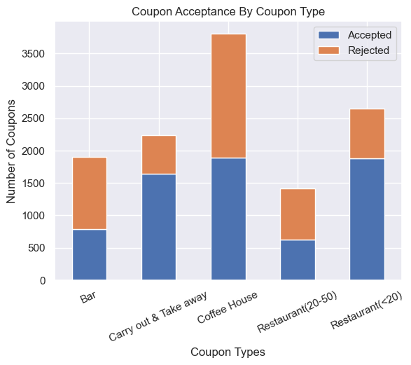 
* Targeting drivers that infrequently went the different businesses types offered (`Bar`, `CoffeeHouse`, `CarryAway`, `RestaurantsLessThan20`, `Restaurant20To50`)

### 3.3 Coupon acceptance was ***generally more likely*** when:
* The driver wasn't rushing to work or back home (`destination`) 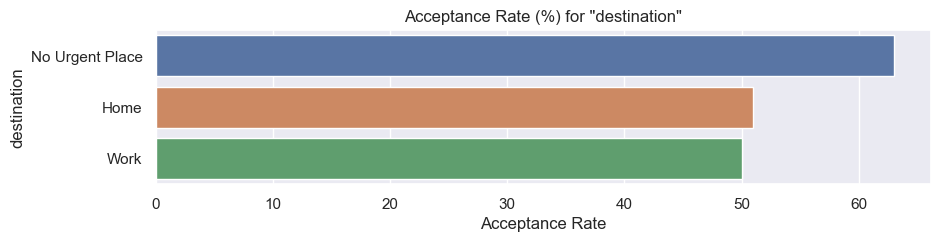 
* The weather was both sunny and hot (`weather`, `temperature`) 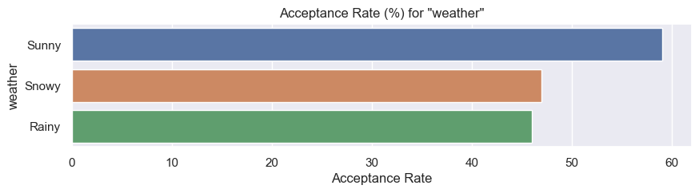 
* Friend(s) were in the car, suggesting perhaps they noticed the coupon soon after it was offered, minimizing time to business destination. (`passengers`) 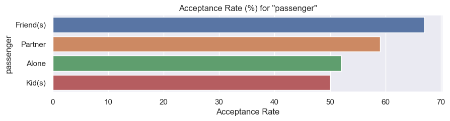 
* The type of coupon was for cheaper restaurants or carry out/take away, though more coupons were offered for coffee houses (`coupon`)  
* The driver could go back later to use the coupon within one day, though the two hour coupon showed some success when delivered (`expiration`)
* Offered at either 2PM or 10AM, though larger volumes were offered during 7AM and 6pm (aligning with general work commute timing) (`time`) 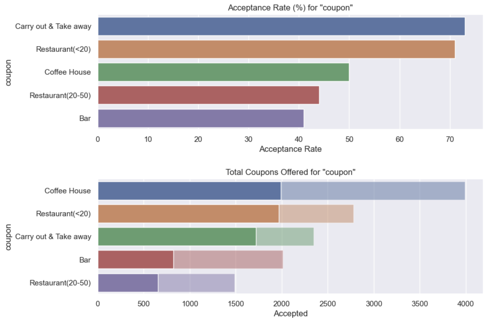 
* Offered to drivers in their 20s.  While the "under 21" group had the least volume of coupons offered, they had the highest acceptance rate, suggesting they should potentially be targeted more (likely college-age/students?) (`age`) 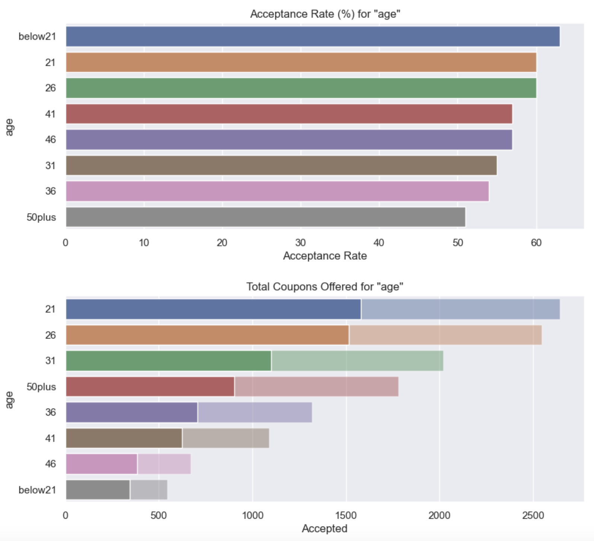 
* Offered to drivers that were single, suggesting more schedule/decision making flexibility, or propensity to enter social situations ("going out") (`maritalStatus`) 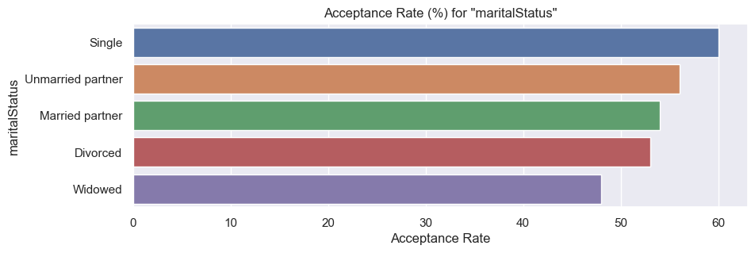 
* The driver that had some college, but not yet a degree, though those with only a high school degree had a higher acceptance rate (low volume offered) (`education`) 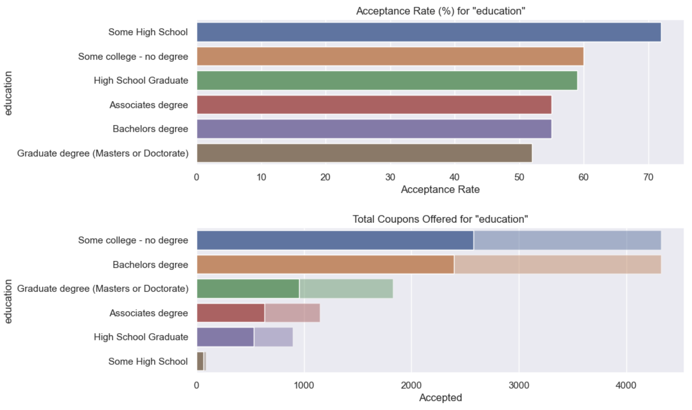 
* The driver was in either healthcare support, construction and extraction, healthcare practitioners and technical; though the highest amount of coupons targeted those that were unemployed or students, which instinctually would make sense, but did not yeild the highest acceptance rates (`occupation`) 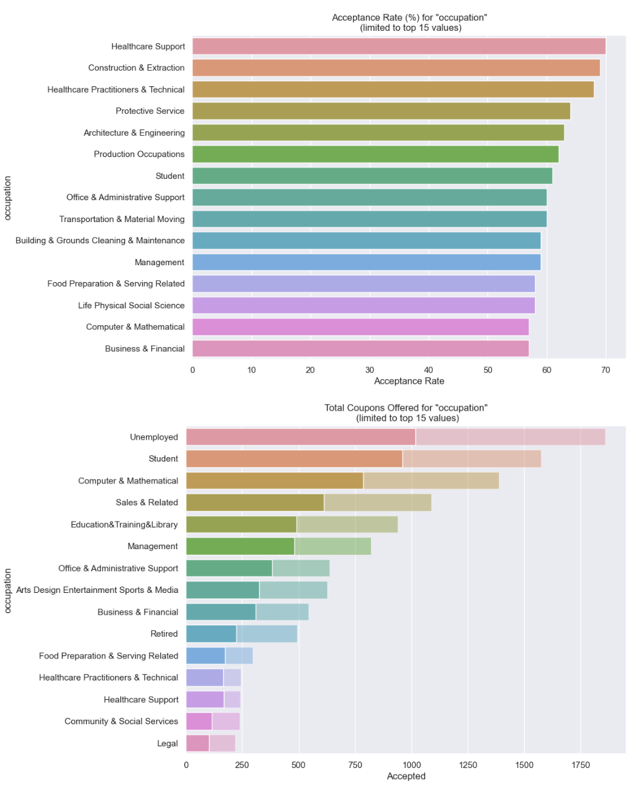 
* The driver's income was below the national average (US), though oddly drivers making the highest incomes also accepted coupons (`income`) 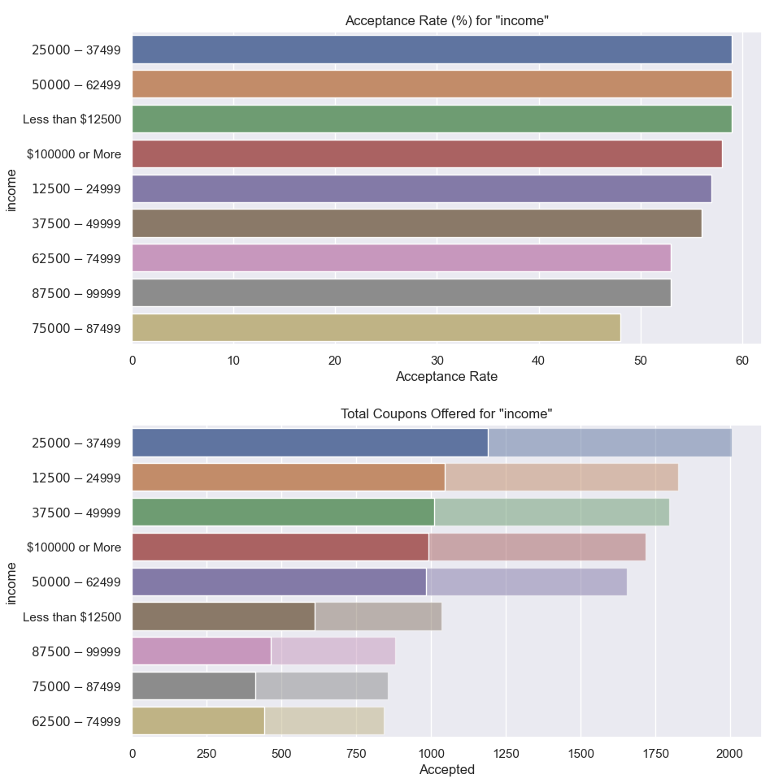 
* The driver was less than 15 minutes from the coupon's location (`distanceDirection`) 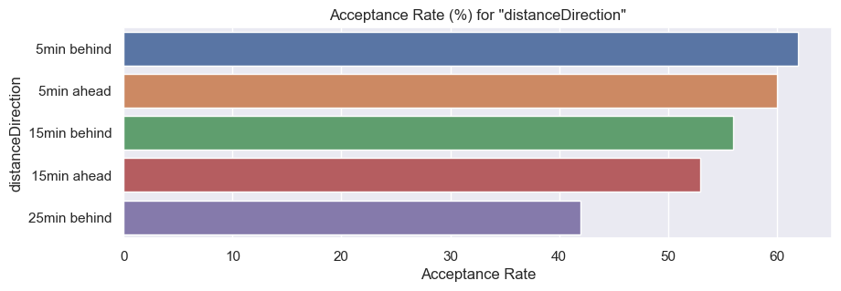 
* Considering combinations of proximity, time of day and expiration time. (`distanceDirectionTimeExpiration`) 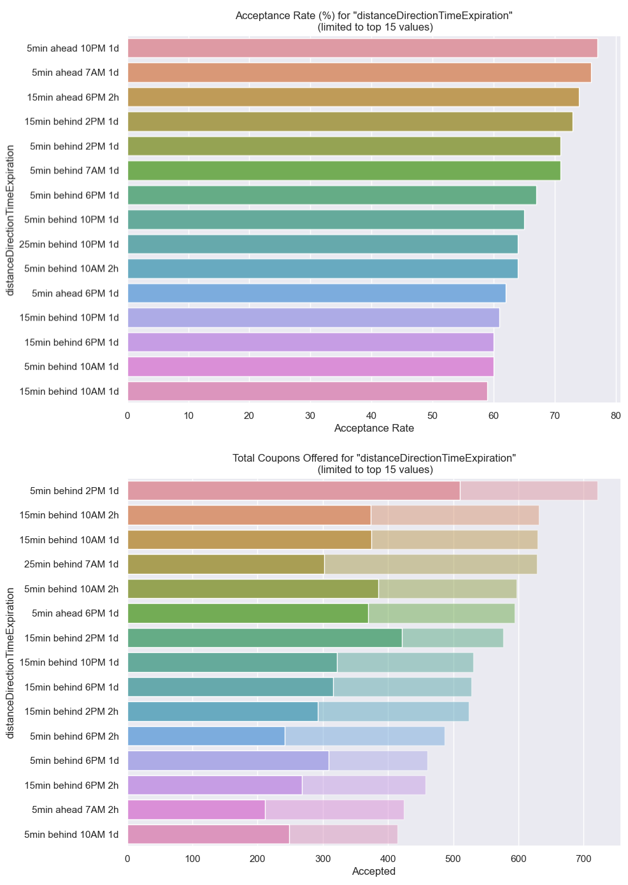 

### 3.4 Deep dive into "Bar" coupons:
* Of the total population of customers that were served a bar coupon, *less than half (~41%) accepted the coupon. 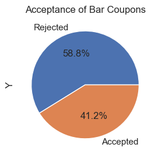 
* Customers that visit a bar more than three times per month are **twice as likely to accept a "bar" coupon** than those that visit a bar three or less times a month. 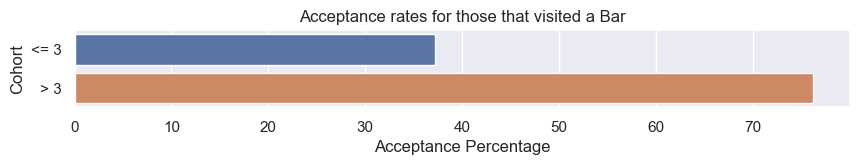 
* Customers over 25 years of age that visit a bar one or more times per month are **twice as likely to accept a "bar" coupon** than those that are younger than 25 and visit a bar less frequently. 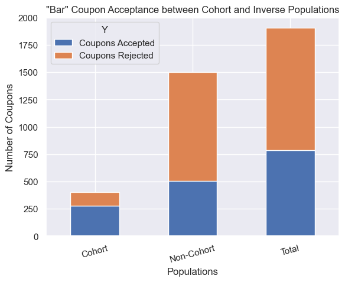 
* Customers who didn't work in Farming/Fishing/Forestry, were travelling with an adult passenger, and visit a bar one or more times per month are **twice as likely to accept a "bar" coupon** than those that worked in Farming/Fishing/Forestry, were travelling either alone or with kids, and visited a bar less than once a month.  
* Customers who fit any of the following three cohorts were **1.4 times as likely to accept a "bar" coupon** than those that were not in any. 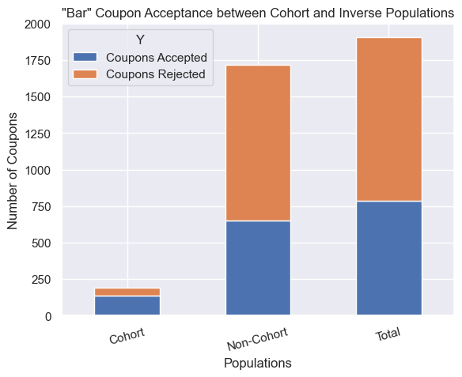 
    * go to bars more than once a month, had passengers that were not a kid, and were not widowed OR
    * go to bars more than once a month and are under the age of 30 OR
    * go to cheap restaurants more than 4 times a month and income is less than 50K.

### 3.5 Insights regarding "Restaurant<20" (cheaper restaurants) coupons:
* Generally, less expensive restaurant coupons have a reasonably good acceptance rate. 
* Time of day and who's in the car with the driver does play a role in acceptance. 
    * For instance, when with friends or partner, acceptance of these coupons at 6pm is very strong (aligning with dinner time for many). 
    * When driving with kids in the vehicle, mid afternoon and evening times show higher acceptance rates, aligning with after-school pickups and dinner time.
    * Interestingly, when driving alone in the evening, coupon acceptence is very low, but much stronger during the middle of the day, perhaps suggesting many survey recipients did not prefer to eat dinner alone, and may be inclined to grab a late lunch / snack at whim when alone (provided it was nearby)

 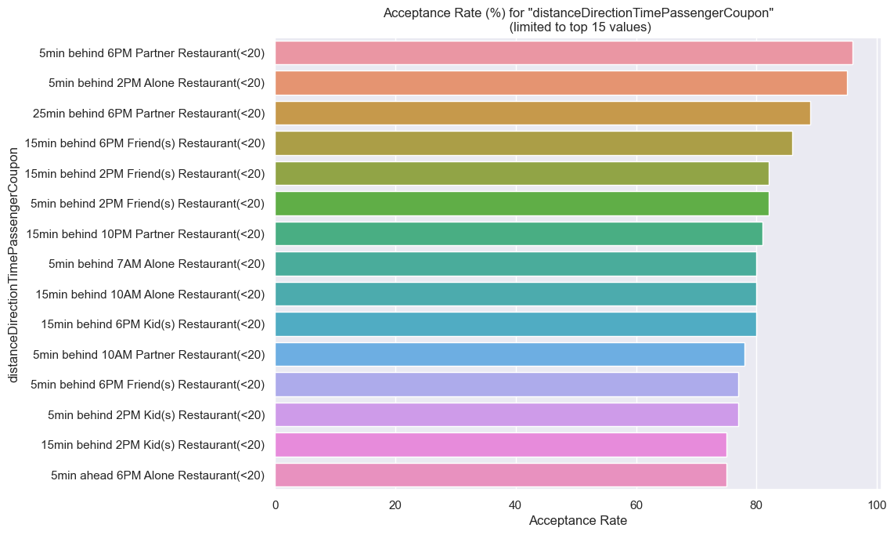 

## 4. Next Steps

### 4.1 Explore Different Approaches to Interpolating the Missing Data:
* Seek any additional data/correlations to interpolate values for `car`
* Can the missing data for visits (`CoffeeHouse`, `Restaurant20To50`, `CarryAway`, `RestaurantLessThan20`, `Bar`) be interpolated some correlative means, as statistical interpolation would not be appropriate for the categorical values (converting category values to numerical representation would be incorrect, based on the implied ranges)

### 4.2 Additional Modeling and Evaluation:
* Continue to review different (mulitvariate) cohorts for any new insights and recommendations to influence the model's algorithm.
* Update plotting approach to visualize counts and means for feature values within a single plot to improve visual context for analysis
* Evaluate different model types for best approach.

### 4.3 Consider Legislative/Regulation Adherence:
* Review any existing laws within each geographical region this coupon product would target a customer, e.g. [US' "Distracted Driving | Cellphone Use" laws](https://www.ncsl.org/transportation/distracted-driving-cellphone-use#:~:text=Hand%2Dheld%20cellphone%20use%20ban,hand%2Dheld%20cellphones%20while%20driving. "Source: ncsl.org"), indicating 29 states/regions prohibit the use of cell phones while driving
* Consider adjusting *geo-fencing* whitelist/blacklist to comply with any discovered restrictions, as we can infer it unlikely for a solo customer to *legally* act on a coupon notification while driving. Is there a means to know if the recipient is a non-customer, and therefore may more readily see the coupon offer in a timely manner?

### 4.4 Ethnographic Influences on Coupon Targeting:
* While target regions for the survey was not indicated in the dataset provided, anonymized **ethnographic information or preferences by region** may be available through other datasets to explore how it may encourage greater coupon acceptance.  
* For example, a customer known to reside in an area with a high Muslim population (or potentially self-identifies as Muslim) would be inlikely to accept a coupon to a bar.

### 4.5 Product/Technology considerations:
* The analysis suggests most coupons are being delivered to the customer's cell phone after they have passed the coupon's location, adding "going backwards" as a consideration in detouring from the intended travel.  Perhaps the technology and product "geo-fencing" trigger rulesets can be made more efficient to send more coupons "ahead of" the driver's current location (somewhat predictively).
* Integrate with localized weather feeds, as weather seems to drive acceptance when considering a coupon
* Review coupon targeting criteria based on bivariate and multivariate analysis and findings to test new cohorts for acceptance performance.