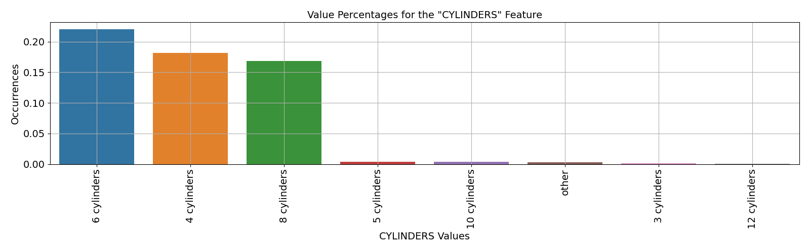
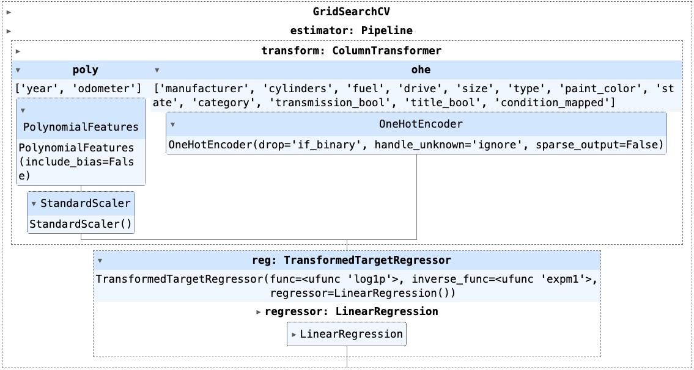

# What drives the price of a car?

<!--   -->
Inspired by the ***CRISP-DM*** data analysis framework, the following summary uses statistical analysis and visualizations to help our client -- a used car dealership -- by recommending which features in a used car customers value most when making a purchasing decision. These feature recommendations will allow our client to determine which used cars may have quicker sales turnaround, and which may become stagnant inventory, taking up valuable space within their lots. They may also be able to get a recommendation for how to price the car based on it's features.

The summaries and hypotheses indicated below are supported by the raw technical and statistical evaluations found within this [Jupyter Notebook](https://github.com/ard1038/data-analysis/blob/master/used-car-pricing-predictions-pa2/used-car-pricing-pa2.ipynb).

## 1. Business Understanding

"Swift Ameet's" Pre-Owned Car Emporium ("SPACE"), a used car dealership, aims to optimize its inventory management to reduce the duration a used car spends unsold on their premises. Vehicles lingering on the dealership lots not only occupy valuable space that could be used for more marketable cars but also immobilize essential operating capital until they find a buyer.

By refining their inventory to align more closely with used cars featuring the most sought-after attributes and setting optimal prices, they can accelerate the sale of their cars. This, in turn, enhances cash flow and ultimately boosts profits by facilitating more frequent sales, essentially improving the return on investment (ROI).

### 1.1 Business Goals and KPIs

The client is keen to understand the following, to optimize inventory purchases such that used cars do not sit on their lots for too long.
* To inform which used cars to acquire for resale, which factors and features do customers value most when making a used car purchasing decision?
* To inform how to optimally price new inventory, what factors and features make a car more or less expensive?

### 1.2 Data Mining Goals and KPIs

Through statistical approaches, used car sales data will be analyzed to understand which car features offer the best predictive power in determining the sale price.  The strongest features will then be the basis for recommending which used cars would be most desirable to consumers, when considering how to stock inventory.

To build confidence in the recommended feature set, multiple algorithms will be explored, to determine if the recommended feature set remains consistent between different modeling. The modeling algorithm with the lowest reasonable error will be deemed the best solution.

The best model will then be reviewed for relative impact of each valuable feature and their predictive power (magnitude of coefficients) /algorithm will eventually become a testing tool provided to our client to guide future used car inventory to minimize the time a car sits in their car lot (ROI).

*Worth noting, while the entire dataset contains less than 16% missing data, high percentages of missing data are contained within a few key features that could be otherwise useful in contibuting to more comprehensive modeling. Best attempts will be made to cleanse these features where possible and reasonable to balance data integrity without losing potentially useful patterns (variance).*

## 2. Understanding the Data

As a preliminary exploration of the dataset (EDA), various statistical approaches and visualizations are reviewed: 
* Review data integrity to inform decisions to either transform, impute, or drop null data values from the dataset. (e.g. measures of central tendency, missing values, duplicated records)
* Understand each feature's value sets and data type to determine if any type changes or feature engineering will be beneficial. (univariate analysis)
* Generate a correlation matrix to understand if any features demonstrate multicollinearity and should be omitted from the prepared dataset to model against. (bivariate analysis)
* Generate plots as relevant to understand how different feature values may impact sale pricing.

As noted, ideally the significant amount of missing information would be reviewed with the subject matter experts to best understand how it was assembled, and how best to maximize it's usage.

From this analysis, the following observations, inferences, conclusions and next actions to prepare the dataset for modeling are detailed.

### 2.1 Data Integrity

The following actions will be completed in the listed order, as sequence of steps will be relevant to maximize the amount of useful remaining data to model from:

1. ***Unreliable features to cleanse:*** 
    * `VIN` feature's value review indicates that the same specific vehicle (unique VIN) may have been listed in multiple locations, and therefore we cannot rely on `region` or `state` columns when modeling as we're not clear on where it was ultimately sold. 
    * This observation is confirmed by reviewing number of duplicated records when `region` and `state` fields are dropped, and all others remain as-is, queried by `VIN` value (e.g. "3C6JR6DT3KG560649").
    * To correct this, for any `VIN` values that occur more than once, only the first one will be retained, the duplicated records will be dropped to preserve the integrity of `region` and `state` features.
2. ***Drop records with outliers:***
    * `price` contains significant outliers that may negatively impact modeling.
    * `odometer` contains significant (and unrealistic) outliers that may negatively impact modeling.
2. ***Unneeded features:*** Drop the `id`, `VIN`, and `model` features:
    * `id` feature is not valuable for modeling, as it's simply a record identifier.
    * `model` feature has over 29k unique values, where it seems a fair amount of variants -- requires heavy sanitization with unclear value thereafter, so dropping the feature for current modeling exercise.
    * Also dropping `VIN` since by it's definition, it's a unique value, and has 38% of it's values missing.
3. ***Drop duplicate records***
    * With `VIN` duplicates resolved above, any remaining duplicate records will be removed now that `id`, `VIN`, and `model` features are no longer holding uniqueness.
4. ***Imputing or dropping remaining missing values***: This dataset is missing a significant amount of values across multiple features. 
    * When reviewing the missing value data by impacted features, it seems more desirable to keep as many records intact by imputing values for both numerical and categorical features with missing values.
    * For numerical features, impute missing values with the `median()` value of the feature. Test using `mean()` value for the feature as well, to understand if one supports a more performant model.
    * For categorical features, impute missing values with the `most frequent` occurring value in that feature, noting that this action may reinforce a bias. Smarter ways to impute may be researched in a later phase.

### 2.2 Univariate Analysis

*  Cars manufactured by ***Ford***, ***Chevrolet*** and ***Honda*** were most available for resale, totaling approximately 38% of the total used car market. (`manufacturer`)

* When car condition was recorded, the vast majority were in either ***good*** or ***excellent*** condition. (`condition`)

* When the number of cylinders was recorded, ***6-cylinder*** cars were the most common (22%), closely followed by ***4-cylinder*** (18%) and ***8-cylinder*** (17%) cars. Cylinders may be converted to a numerical value. (`cylinders`)

* Cars fueled by ***gas*** were most abundant (83%), as expected, since internal combustion engines have been the primary engine type outside of the past few years. Any recommendations around fuel type will likely evolve as more EV and hybrid vehicles cycle through lease and resale markets in upcoming years. (`fuel`)

* Almost 95% of all available used cars indicated a ***clean*** car title, necessary for smooth transfer of ownership upon purchase. (`title_status`)

* Unsurprisingly, ***automatic*** transmissions were most common in used cars (79%). (`transmission`)

* When the drivetrain type was indicated, ***4wd*** used cars were most common (~31%), followed by front-wheel drive (***fwd***, 25%), and then rear-wheel drive (***rwd***, 14%) (`drive`)

* When car size classes were indicated, ***full-size*** cars were available almost 84% or higher than other vehicle size classes, followed by ***mid-size***, ***compact***, and ***sub-compact***, respectively. (`size`)

* Aligned with above observations regarding size, drivetrain, and cylinders, when car type was indicated, ***sedans***, ***SUVs*** and ***pickups*** comprised almost 50% of all available cars. (`type`)

* When car color was indicated, ***white***, ***black,*** and ***silver*** were most common (respectively), representing over 43% of available cars. (`paint_color`)

* With an average milage of 98K, there are outliers that should be removed: used cars are unlikely to have no miles on them, nor survive to have 10MM miles. (`odometer`)

* A significant portion of the used cars were manufactured in the past 20 years. (`year`)

* The target feature, the car’s price, contains extreme values, as well as what appear to be artificial values (e.g. $111111) which will impair the model’s ability to properly predict pricing based on the car’s features. (`price`). A means to classify and exclude these artificial values as outliers will be created to reduce this data pollution risk. The logorithm of `price` target feature will also be used in modeling to help normalize the right-skew distribution.

### 2.3 Bivariate Analysis

* When evaluating ***correlations*** between the original numeric variables, no variables seemed to be strongly correlated to another; none of the variables demonstrated multicollinearity.
* Correlation will be reviewed again after feature engineering and data transformation is implemented, expanding the number of numerical features

### 2.4 Target Feature Analysis of Each Categorical Feature

Each categorical feature was then reviewed by average price, to understand if any categorical feature values. 

*  Cars manufactured by ***Mercedes-Benz***, ***Volvo*** and ***Toyota*** had the highest average price. (`manufacturer`)

* When car condition was recorded, the higest average price actually came from cars in ***fair*** condition. (`condition`)

* ***8-cylinder*** cars seemed to be most expensive than the more common ***6-cylinder*** cars. (`cylinders`)

* Cars fueled by ***diesel*** were the costliest, on average. (`fuel`)

* A ***clean*** car title still fetched the highest average price. (`title_status`)

* Surprisingly, ***manual*** transmissions were demanded at a higher average price, likely due to them being more rare in a market dominated by new cars with automatic transmission. (`transmission`)

* ***4wd*** used cars were also the most in demand, having the highest average price(`drive`)

* When car size classes were indicated, ***mid-size*** cars actually fetched a higher average price than other vehicle size classes. (`size`)

* ***Pickup*** type of used cars show highest average price far above all other types. (`type`)

* When car color was indicated, ***green*** cars sold for significantly higher price than any other color. (`paint_color`)

* Cars sold in Deleware (***de***) for significantly higher average price than any other color. (`state`)

## 3. Preparing the Data

From the understandings and actions indicated above, the following feature engineering and data preparation will allow us to test multiple model designs for most resilient. 

### 3.1 Feature Engineering

1. For the `transmission` feature, simplify values to `automatic` or `not automatic`, as preparation for onehot-encoding.
2. For the `title_status` feature, simplify values to `clean` or `not clean`, as preparation for onehot-encoding.
3. Based on the `year` numerical feature, create a new categorical feature `category`, which will classify cars into the following age groupings, to model the impact of older used cars on pricing: (reference: [Understanding the Difference Between Classic, Antique, and Vintage Cars](https://americancollectors.com/articles/vintage-vs-classic-vs-antique-cars/ "from: American Collectors Community"))
    * "vintage": manufactured between 1919-1930
    * "antique": manufactured before 1979, or >45 years old
    * "classic": manufactured before 2004, or >20 years old
    * "contemporary": manufactured after 2003, or <=20 years old (aka "modern")
4. For the `condition` feature, combine values that seem to be synonyms, e.g. "*new*" and "*excellent*". Some values prevent converting this feature into ordinal encoded value (e.g. "N/A"/missing values).
5. For the target feature `price`, create a new categorization feature to classify "*valid*" price from from "*unrealistic*" based on a custom ruleset derived from reviewing it's value set. 
    * The new feature will later be used to exclude outliers or data anomolies from negatively influencing the model. 
    * From the univariate review, the criteria to qualify a `price` as "*unrealistic*" is if:
        * It's below a threshold of $100.
        * The digits are in a sequence (ascending or descending order, e.g. $12345).
        * It's a single digit, repeating (e.g. $11111).
        * It's above a threshold of $5MM.

### 3.2 Data Transformation

1. ***Increase complexity:*** For the few numeric features, transform them into their polynomials, where the degree of complexity will be tested for most optimal. (`PolynomialFeatures`)
2. ***Data standardization:*** As the numeric features are observed to have different scales of data, they will need to be scaled, such that all features may be penalized equivically when regularization models are tested.
3. ***Binarizing features:*** After cleansing the categorical features (noted above), the features will be binarized to be used in regression modeling.

## 4. Modeling

As indicated earlier, our dataset to model from is not as clean as would be ideal. The data has been cleansed and new features have been engineered, three (3) different modeling techniques will be used to perform regression analysis on the historical dataset, with the goal of reasonably predicting pricing and understanding which key features impact pricing the most.

### 4.1 Modeling Techniques

The following three (3) regression techniques will be used to model the relationships between different car features (as indicated within our dataset), and sale price. 
1. Linear Regression
2. Ridge Regression (aka L2 Regularization)
3. Lasso Regression (aka L1 Regularization)

### 4.2 Modeling Goal

The objective of each regression modeling technique is to discern the car features that significantly influence the selling price and determine the extent of their impact. The goal is to establish a robust and accurate algorithm that can be consistently employed for making inventory and pricing decisions in the future.

### 4.3 Model Design and Parameters

Each model is built using the same prepared and transformed data from earlier steps, varying hyperparameters to optimize it's own performance (balancing error and score). Each model is designed as indicated below:

#### 4.3.1 Common Model Design Parameters
The following approach and parameters are common to all model candidates:
*  Cleaned and prepared dataset size and number of features:
    * Original dataset size: 426,880 records
    * Cleaned dataset size: 99,225 records
    * Percentage of Original Data Preserved: 23.2% (Note: earlier notes regarding missing and duplicative data)
* Train/Test ratio: *70/30*
* Final features each model will use and transform:
    * year
    * manufacturer 
    * cylinders
    * fuel
    * odometer
    * drive
    * size
    * type
    * paint_color
    * state
    * category *(engineered feature)*
    * transmission_bool *(engineered feature)*
    * title_bool *(engineered feature)*
    * condition_mapped *(engineered feature)*
* Target feature: `price`
    * Based on it's right-skewed kernel density plot (KDE), the logarithm of the target feature will be used to better normalize it's values for modeling (`TransformedTargetRegressor()`) 
* Hyperparameters:
    * *degree* for `PolynomialFeatures()`: `[ 1, 2, 3 ]`
* Cross-validation through `GridSearchCV()` with `K-folds = 3` 

#### 4.3.2 Model Design for **Linear Regression**
* Additional hyperparameters: *fit_intercept* for `LinearRegression()`: `[ True, False ]`
    

#### 4.3.3 Model Design for **Ridge Regression** (L2 Regularization)
* Additional hyperparameters: *alpha* for `Ridge()`: `np.logspace( -2, 3, 15)`

#### 4.3.4 Model Design for **Lasso Regression** (L1 Regularization)
* Additional hyperparameters: *alpha* for `Ridge()`: `np.logspace( -2, 3, 15)`

## 5. Evaluation

While each of the above regression techniques has a different mathematical approach to determine it's best modeling parameters, they are all similarly measured and optimized through cross-validation of specific evaluation metric(s).

### 5.1 Choosing Evaluation Metrics

When determining which evaluation metrics are best suited to optimize the models, the following criteria are considered:
1. Type of problem being solved by the model 
2. Distribution of the data, to best accommodate outliers
3. Interpretability of the analysis

The following rationale determined final selection of evaluation metrics:
1. Since this model needs to predict sale pricing based on car features, mean squared error (MSE) or root mean squared error (RMSE) are appropriate. 
2. While MSE and RMSE are more sensitive to outliers in car features, outliers (e.g. unreasonably low and high values for odometer and price) have been addressed through data preparation. 
3. Using RMSE provides a more interpretable measure of prediction error magnitudes in the same unit and scale as the price, making it easier to understand.
4. Using the prediction scoring (e.g. R-Squared) will offer additional guidance on accuracy of each model.

For these reasons, the following metrics will be used to evaluate and optimize each model to determine the best performing parameters that minimize the error, while offering the best prediction scoring:
* RMSE (error)
* R-Squared (scoring)

### 5.2 Reviewing Model Optimization and Results

Each model was optimized through cross-validation to determine which of their hyperparameter values were best suited to minimize the model's loss function (RMSE) and maximize it's prediction score (R-Squared).

The table below indicates the modeling technique, the optimized hyperparameter values that resulted in the lowest error value for the testing dataset, as well as the prediction score (as a decimal). 

From this review, the best overall model for this dataset is using the `Ridge Regression` model with hyperparameters of `degree = 3` and `alpha = 0.268`, which results in reasonably similar RMSE and R-Squared scoring for both the training dataset, as well as the unseen validation dataset.  This closeness in performance between the training and validation sets of data offers some confidence in how the model may perform when new data is reviewed for pricing prediction.

**Summary:**
* *Best model:* `Ridge Regression`
* *Optimized Hyperparameters:*
    * Regularization penalty term `alpha = 0.268`
    * Complexity `degree = 3`

### 5.3 Most Impactful Features

The best performing model, acheived through the Ridge regression analysis technique, returned ***150 factors*** (or coefficients) that not only provide a means for predicting price for future used cars taken into inventory, but can also offer guidance on which features are most impactful in driving the price. 

The coefficients have both a magnitude, as well as a positive or negative value sign; positive coefficients will positively impact the price (increasing it), whereas negative coefficients will decrease it, for the feature in question. The following three (3) bar charts showcase all 150 factors, which are all mathmatical combinations of our original 14 features; by design, the model seeks to test mathmatical combinations of features to improve it's accuracy, but not all combinations are valuable, as indicated in the charts as well. 

## 6. Deployment

With each model candidate now optimized for it's hyperparameters based on the evaluation metrics, the one that performs best overall is selected to put into practice. While a deployable model was not created as part of this assignment, it could be done so some effort by saving the model via a utility like `pickle`, and then reading it in runtime when features are provided for a used car being considered for inventory.

## 7. Recommendations for Inventory

As visualized in the charts above, the relative impact of any coefficients beyond the first 25 or so are of reasonably equal and low impact on driving the price of a used car up or down. When focusing only on the top 25 positively or negatively impactful coefficients, the following zoomed in chart can be referenced.

The following insights gleaned from the coefficient magnitudes may be used to qualify adding a new car to inventory:
* Likely obvious, the model confirms that both age (`year`) and mileage (`odometer`) of the used car have a significant negative impact on the sale price.
* A used car considered to be an "antique" (`category`, based on being at least 45 years old; defined above) will positively impact the used car's value and price.
* Certain car makers (`manufacturers`) seem to have a positive impact on pricing, while others seem to have a negative impact:
    * Datsun, Ferrari, Aston Martin, and Tesla positively impact pricing
    * Harley Davidson, Fiat, Mercury, and Mitsubishi seem to have lower resale values
* When it comes to the the car `condition`, salvaged used cars negatively impact pricing, whereas cars deemed in excellent or good condition will drive the price higher.
* 12-cylinder vehicles are also a good purchase, as they improve pricing, whereas 3-cylinder vehicles are the opposite, driving the price down.
* Diesel engines are also in demand, driving the price of the car higher. 
* It's not recommended to buy buses, as they then to drive the pricing lower.

CSV files for each model's resulting coefficients, including the Ridge Regression model results, [can be found here](results/). Please feel free to download and review offline.

## 8. Next Steps

1. With the initial model trained and capable of pricing predictions, deploying the application and creating a maintenance and monitoring plan to allow the client to self-serve when new inventory is being acquired will be a natural next phase.
2. While the model is scoring above 66% on predictions, the model will be monitored as new data becomes available to determine if prediction scoring will change positively, negatively or remain neutral. 
3. A broader view of all coefficients will occur to not only understand was features are impactful, but also confirm which are not. But understanding the unimpactful features, they should then be features the dealership will not pay extra for to acquire a used car, as it will not reflect positively in the price they may sell it for.
4. The model's significant data gaps may be correctable after some dialog with those that assembled the initial data. If the data cannot be further enriched organically, then a deeper dive into imputation may be valuable to improve robustness of the model. 